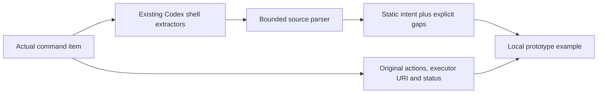

# Current Codex integration scope

Pinned official base: `ca466061d64f0b44f416135c7fd06aa7af850bbc`, fetched again
on 2 October 2026 before creating this fork branch. This is an in-tree discussion
prototype, not a live core/app-server/UI integration.

## What is actually implemented

`src/codex_adapter.rs` borrows the real
`codex_protocol::items::CommandExecutionItem`. It calls existing
`codex_shell_command::parse_command::extract_shell_command` and
`bash::extract_bash_command` on original argv. Accepted Sh/Bash/Zsh carriers are
analysed with the bounded Bash grammar; PowerShell, direct interpreter argv and
excessive input abstain explicitly. The adapter preserves the original item,
including conservative parsed commands, executor URI, lifecycle status, process
ID and exit code. It never replaces `ParsedCommand` or infers observed changes.

Initial cwd is unresolved inside the parser. The executor `PathUri` remains on
the borrowed item, preventing accidental POSIX concatenation or local filesystem
capture on a foreign executor. Literal source cwd changes remain conditional
intent. `LocalFiles` is a separate standalone demonstration, not Codex's runtime
filesystem adapter.

Twelve tests use actual Codex types and extractors, checking argv/actions,
status independence, source nesting, foreign URIs, invalid input, unsupported
shells, size bounds and inert comments/strings. The
[synthetic output](../examples/codex_item.output.json) is generated by
`cargo run -p codex-code-activity --example codex_item --locked`. This serialization
is only a local example, not a generated or supported app-server schema.

## Remaining live integration work

1. **Ownership and transport.** Agree parser scope and location with maintainers.
   Add a separately experimental activity field/notification; update generated
   JSON/TypeScript/Python schemas and test public JSON-RPC compatibility. Existing
   Read/ListFiles/Search/Unknown actions remain conservative compatibility data.
2. **Streaming and final dispatch.** `ToolArgumentDiffConsumer` in
   `core/src/tools/registry.rs` offers input deltas; input completion is not
   process completion. Coalesce/throttle previews, replace/retract revisions,
   bound cumulative work and reanalyse command rewrites performed by pre-tool
   hooks in `core/src/tools/handlers/unified_exec/exec_command.rs`.
3. **Items and history.** Wire first-class `ItemStarted`/`ItemCompleted` and legacy
   approval/history reconstruction together. Preserve thread replay and avoid
   duplicate predictions. Current item/history/event builders span
   `core/src/tools/events.rs`, app-server protocol item builders/event mapping,
   and thread history; changing one mapper is insufficient.
4. **Code-mode child reconciliation.** `ToolCallSource::CodeMode` carries cell
   and runtime tool-call identity in `core/src/tools/context.rs`. Cells can outlive
   turns; runtime child IDs are not globally unique. Reconcile predicted nested
   calls against concrete dispatched child args and environment/turn provenance.
   This adapter has parser source nesting only, not that runtime relationship.
5. **Observation and lifecycle.** Use selected environment plus async
   `ExecutorFileSystem` and permission context. Design cancellation, delayed PTY
   exit, background descendants and bounded no-follow capture. The current
   streaming filesystem read API lacks a follow-symlink option; post-read
   truncation cannot establish a hard capture bound. `TurnDiffTracker` exact
   apply-patch evidence is distinct from capture-interval file comparisons.
6. **Disclosure and validation.** Apply host secret redaction and path/snippet/diff
   disclosure rules before transport. Add held-out hand-labelled precision,
   fuzzing, realistic Code Mode replay, remote/Windows executor tests, binary
   size/latency evaluation and all upstream CI lanes. Synthetic source examples
   do not establish production accuracy or a hard wall-clock deadline.

The current official [contribution policy](https://github.com/openai/codex/blob/ca466061d64f0b44f416135c7fd06aa7af850bbc/docs/contributing.md#L5)
states that external code contributions/PRs are not accepted. This PR targets
Sean's own fork for his discussion, with no upstream submission or reviewer
request.
